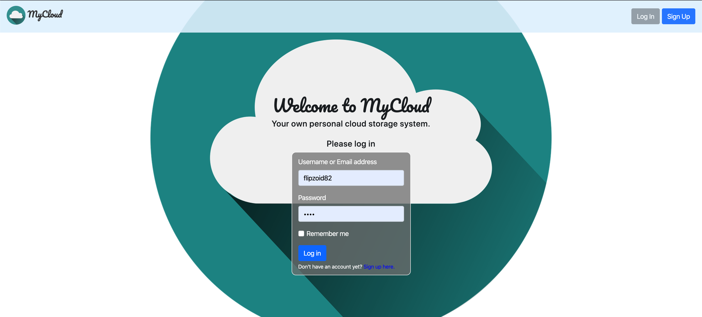
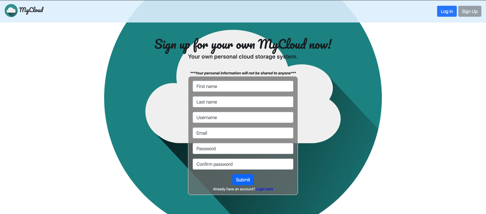
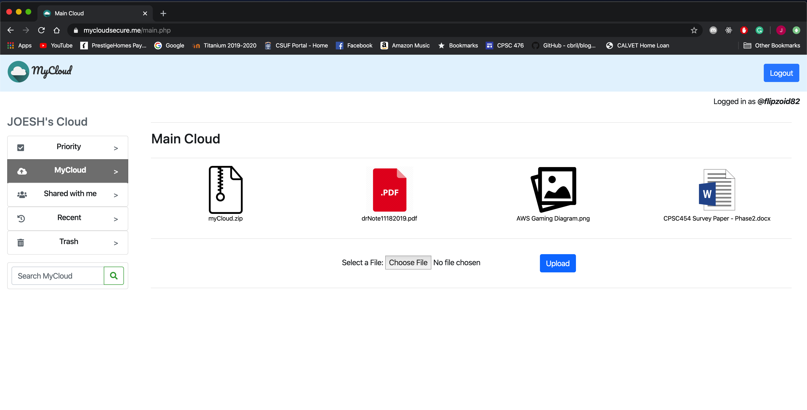
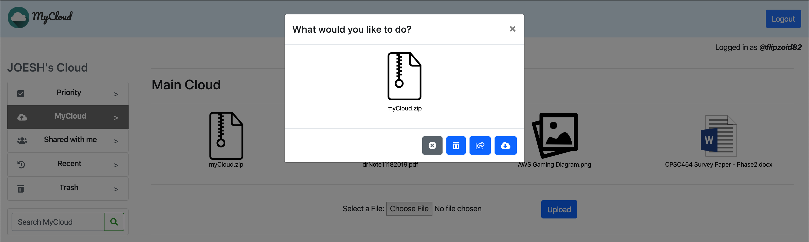
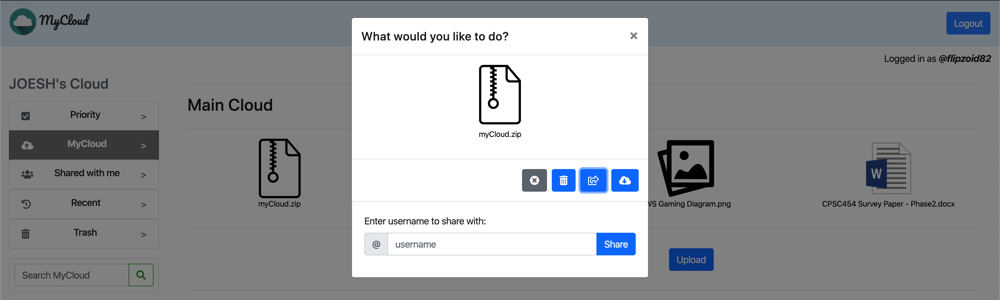
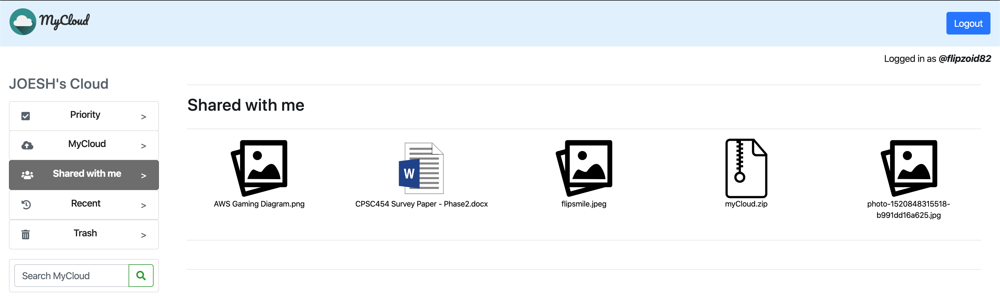
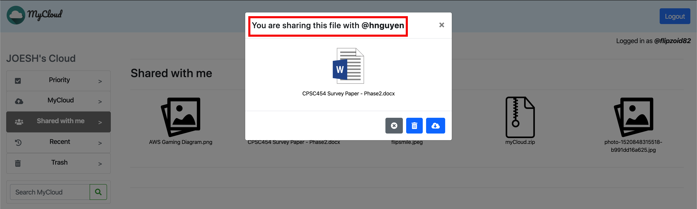
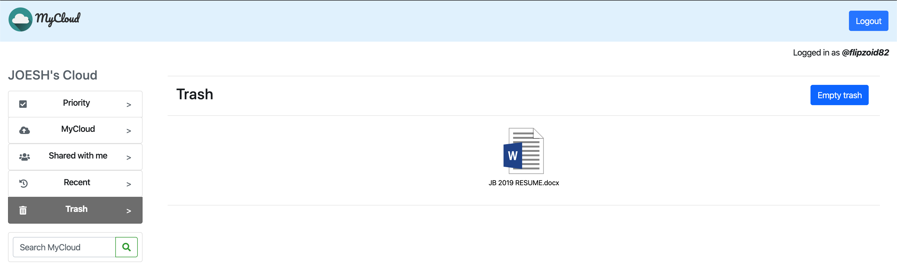
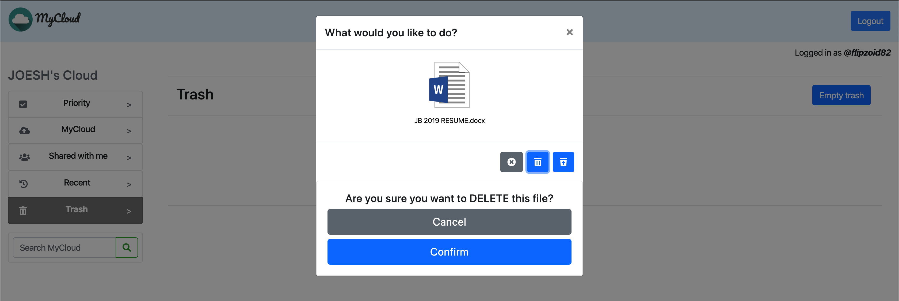
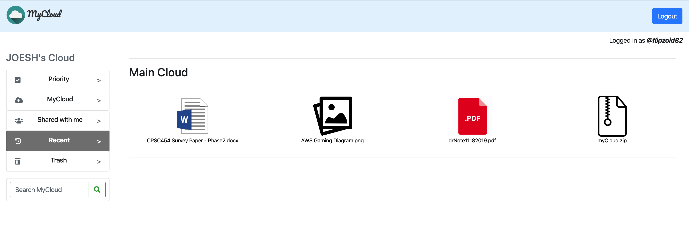

# CPSC 454 - Class Project: MyCloud Secure

## This project was developed by:
### Hector Rodriguez: 
- Mobile Integration, AWS Administrator/Implementation
### Kayla Nguyen: 
- TLS/HTTPS Implementation, Backend 
### Joesh Bautista: 
- Frontend Design, Backend and AWS Implementation
---
## Technologies used:
- AWS: IAM, Elastic Beanstalk, S3, RDS
- HTML, CSS and Bootstrap 4
- PHP
- MySQL

### **The src code for the mobile version of the app is located here:**
- <a href="https://github.com/hectorRod101/MyCloudSecure" target="_blank">https://github.com/hectorRod101/MyCloudSecure</a>

### **Our video presentation can be found here:**
- <a href="https://youtu.be/53WhmsXi_i0" target="_blank">https://youtu.be/53WhmsXi_i0</a>

### MyCloud Secure is live: <a href="https://www.mycloudsecure.me" target="_blank"> https://www.mycloudsecure.me</a>
---
### **The following demonstrates the functionalities of the webApp:**

1. **Login/register:** 
    If you already have an account, simply sign in. 
    >
    > Login implements the following security features:
    > - Wrong Password
    > - Invalid username / email
    > - Access denied if trying to access a page that requires *login* credentials 
    
    If not, then you can register and then login afterwards.
    >
    > Register implements the following security features:
    > - Duplicate username / email error
    > - Invalid email
    > - Passwords do not match
    > - Password too short

2. **After a successful login, you will see this screen:**
    >
    > - From here, you can see your files and perform various things to them. 
    > - **Logout** by clicking the 'Logout' button on the far right of the navbar.

    When you click a file, a modal will popup with options you can do with that file:

    >
    >From here you can:
    > - Download the file
    > - Share the file
    > - Move the file to trash
    > - Or close the modal

3. **Sharing a file:** 
    When the share button is clicked, an input box will appear below the modal.
    >
    >Enter the username and press 'Share' to share the file.

    To check your shared files, click the side-menu: **'Shared with Me'**
    - This will take you to the 'Share with me' page:
    > 
    When you click a file you will see which user you're sharing the file with: 
    >
    >You can also download and delete the file from here.

4. **Deleting:**
    When you move the file to trash, you can check you can see then in the 'Trash' page:
    >
    >From here, when you click a file, you can either restore the file or permanently delete it.
    
    >You can also _empty trash_ by clicking the button on the top right. This permanently deletes all files in the trash.

5. **Recent:**
    >
    >This page sorts the files in the main cloud from *newest to oldest*.
---

